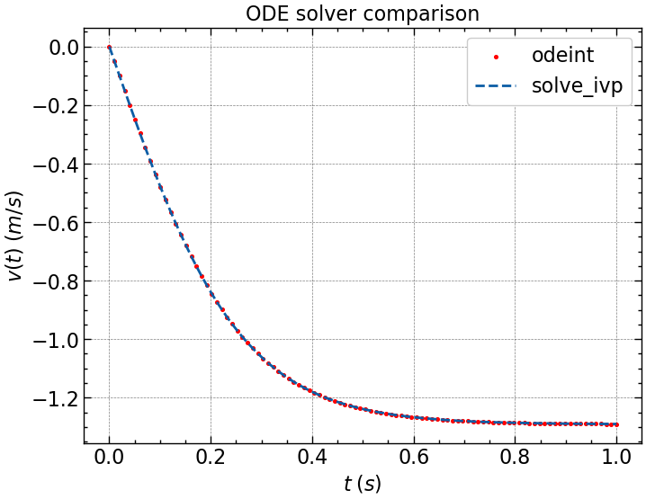

# Numerically solved ordinary differential equations

## 1. First order ODE's (see 01_ode_linear.py)

The example ODE model air friction while falling. The ODE is the following:

$$\displaystyle \frac{dv}{dt} - \alpha v^2 + \beta = 0\\; \mathrm{with\\;initial\\; condition}\\; v(0) = 0$$

where $v$ is velocity, $t$ is time, and $\alpha,\\, \beta$ are constants.

First, we write the ODE in the following form:

$$\displaystyle \frac{dv}{dt} = f(t\\, v)$$

In other words, "the derivative of $v$ equals a function that depends on the velocity $v$ and time $t$". For this case, we can write it as:

$$\displaystyle \frac{dv}{dt} = \alpha v^2 - \beta$$

ODE solution with the solvers "odeint" and "solve_ivp":

<figure>
    
    <figcaption>Figure 1. Velocity as a function of time considering air friction while falling.</figcaption>
</figure>

## 2. Coupled first order ODE's

## 3. Higher order ODE's
