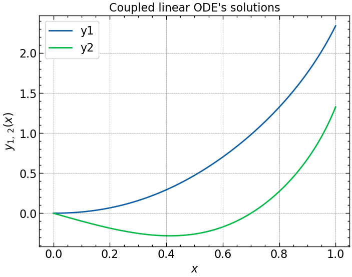

# Numerically solved ordinary differential equations

## 1. First order ODE's

The example ODE model air friction while falling. The ODE is the following:

$$\displaystyle \frac{dv}{dt} - \alpha v^2 + \beta = 0\\; \mathrm{with\\;initial\\; condition}\\; v(0) = 0$$

where $v$ is velocity, $t$ is time, and $\alpha,\\, \beta$ are constants.

First, we write the ODE in the following form:

$$\displaystyle \frac{dv}{dt} = f(t\\, v)$$

In other words, "the derivative of $v$ equals a function that depends on the velocity $v$ and time $t$". For this case, we can write it as:

$$\displaystyle \frac{dv}{dt} = \alpha v^2 - \beta$$

see the file "01_ode_linear.py". The ODE solution with the solvers "odeint" and "solve_ivp":

<figure>
    
    <figcaption>Figure 1. Velocity as a function of time considering air friction while falling.</figcaption>
</figure>

## 2. Coupled first order ODE's

The following are the two coupled fist-order linear differential equations. The are coupled because the two equations depend on each other,
with the terms $y_1,\\,y_2$.

$$y_1' = y_1 + y_2^2 + 3x,\\; y_1(0) = 0$$

$$y_2' = 3y_1 + y_2^3 - \cos(x),\\; y_2(0) = 0$$

The equation system can be rewritten as a vector. Letting $S = (y_1,\\; y_2$ we need to write a function that returns $dS/dx = dy_1/dx,\\; dy_2/dx$.
The function $dS/dx$ can take in $S = (y_1,\\; y_2$ and $x$. In vector form we then have:

$$
\vec{S} = \begin{bmatrix}
y_1 \\
y_2
\end{bmatrix} \Longrightarrow
\displaystyle \frac{d\vec{S}}{dx} = \vec{f}(x,\\;\vec{S}) = \vec{f}(x,\\;y_1,\\; y_2) = \begin{bmatrix}
y_1' \\
y_2'
\end{bmatrix} = \begin{bmatrix}
y_1 + y_2^2 + 3x \\
3y_1 + y_2^3 - \cos(x)
\end{bmatrix}
$$

Now, the vector function $d\vec{S}/dx$ can be programmed defining a function for "dSdx" as $\vec{f}(x,\\; \vec{S})$. See the file "02_coupled_ode.py".

<figure>
    
    <figcaption>Figure 2. y1 and y2 solutions for the coupled linear ODE's.</figcaption>
</figure>

## 3. Second order ODE's

**Python does not have functions to directly solve second or higher order ODE's**

**However, any second order ODE can be converted into two first order ODE's**

Consider the following second order ODE:

$$\ddot{x} = -\dot{x}^2 + \sin(x)$$

We can convert this into a system of two first order ODE's as follows:

- Take $x$, which is what we're trying to solve for. Then, define $\dot{x} = v$, so that $v$ becomes a new variable.
- Note that $\dot{x} = v$ is one differential equation.
- Since $\dot{v} = \ddot{x} = -\dot{x}^2 + \sin(x) = -v^2 + \sin(x)$, we get another differential equation.

Then, the system of two first order coupled ODE's is:

$$\dot{x} = v$$

$$\dot{v} = -v^2 + \sin(x)$$

For this system of ODE's, we are solving for $v$ and $x$. Additionally, it requires initial conditions of $x_0\\; \mathrm{and}\\; v_0$. For example,
$x(0) = 0$ and $v(0) = 5$.

See the file "03_second_order_ode.py" for the programming of this problem.

<figure>
    
    <figcaption>Figure 3. Solution of a second order ODE divided into two first oder ODE's.</figcaption>
</figure>
